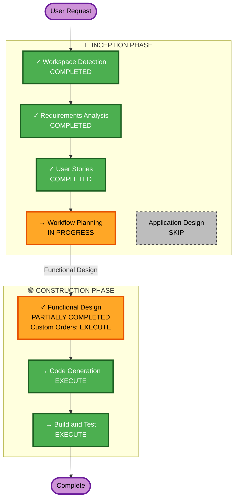

# Execution Plan - Roost Store DECA School Store

## Detailed Analysis Summary

### Project Scope
- **Project Type**: Greenfield (new school store platform)
- **Scope**: Complete school store platform with catalog, ordering, custom orders, role-based operations, analytics
- **Platform**: Google Sites, Google Forms, Google Sheets, Google Apps Script
- **Integration**: Square Payment Links (primary/fallback), future Square API ready

### Change Impact Assessment
- **User-facing changes**: YES - New school store platform with customer-facing storefront, custom order workflows, order tracking
- **Structural changes**: YES - New fallback-store-integration unit with Apps Script backend, form automation, data service layer
- **Data model changes**: YES - New sheet schema with Orders, Products, StoreHours, ClubRoster, PaymentLinks tabs
- **API changes**: YES - New web app endpoints (status, products, mode switch), form submission handlers
- **NFR impact**: YES - Performance, usability, role-based access requirements defined

### Complexity Factors
- **Engraving orders**: Simple item + quantity capture
- **Embroidery orders**: Apparel type selection (multi-select), quantity per type, image upload, resize/reposition controls, preview
- **Heat press orders**: Apparel type selection (multi-select), quantity per type, image upload, resize/reposition controls, preview
- **Custom item orders**: Free-form description, quantity, quote request flag
- **Image manipulation**: Requires client-side image resizing and repositioning controls (not yet implemented)

### Risk Assessment
- **Risk Level**: Medium
- **Primary Risks**: 
  - Image manipulation controls require Google Forms enhancement or external service (needs solution design)
  - Multiple apparel type selection in Forms may require creative form design
  - Preview rendering requires custom UI not native to Forms
- **Rollback Complexity**: Low (no production deployments yet; MVP still in development)
- **Testing Complexity**: Moderate (requires testing all custom order workflows, form logic, sheet automation, web app endpoints)

## Workflow Visualization

## Phases to Execute

### 🔵 INCEPTION PHASE

- [x] **Workspace Detection** - COMPLETED
  - Greenfield project confirmed
  - Workspace initialized

- [x] **Requirements Analysis** - COMPLETED
  - Full requirements with FR/NFR captured
  - 18 clarifying questions answered
  - Requirements approved by user

- [x] **User Stories** - COMPLETED
  - 5 personas created (Student, Teacher, Member, Officer, Sponsor)
  - 15 INVEST-compliant stories generated (12 MVP + 3 post-MVP)
  - Enhanced with detailed custom order specifications (engraving, embroidery, heat press, custom items)

- [x] **Workflow Planning** - IN PROGRESS
  - Executing now

- [ ] **Application Design** - SKIP
  - **Rationale**: Single integration unit with straightforward component boundaries. Users stories provide detailed requirements for custom order workflows. App Script files already created with mode-switching architecture. No new components or complex service layer design needed at this stage; detailed functional design will address custom order logic. Skip to avoid redundant design phase.

### 🟢 CONSTRUCTION PHASE

- [ ] **Functional Design (Custom Orders)** - EXECUTE
  - **Rationale**: Custom order workflows are now detailed with engraving, embroidery, heat press, and custom item specifications. Need to design:
    - Form structure for multi-type custom order capture (apparel type selectors, quantity inputs, image upload)
    - Image manipulation and preview rendering approach (Google Forms limitations vs. alternatives)
    - OrderWorkflow.gs enhancements to handle apparel type routing and image metadata storage
    - Preview before submission pattern for embroidery/heat press
  - **Estimated Complexity**: Medium (multi-apparel type handling, image manipulation design)

- [ ] **NFR Requirements** - SKIP
  - **Rationale**: Non-functional requirements already comprehensively defined in requirements.md (usability, performance, maintainability, reliability, security). No new NFR concerns identified by user. Image manipulation is UX-focused functional requirement, not performance/security NFR.

- [ ] **NFR Design** - SKIP
  - **Rationale**: No new NFR requirements to design. Existing NFR guidance (responsive design, fast load times, easy product updates) are addressed through technology choices (Google Sites, Sheets, Apps Script).

- [ ] **Infrastructure Design** - SKIP
  - **Rationale**: Project uses managed Google Workspace services (Forms, Sheets, Sites, Apps Script). No infrastructure decisions needed (no VMs, containers, load balancers, networking). All deployment is within Google Workspace.

- [ ] **Code Generation** - EXECUTE (ALWAYS)
  - **Rationale**: Functional design will guide enhancements to OrderWorkflow.gs for custom order processing. Code generation will produce:
    - Enhanced form structure documentation for Google Forms setup
    - OrderWorkflow.gs updates for apparel-type routing and image metadata handling
    - Possibly: JavaScript/HTML snippet for image preview if Google Forms cannot render preview natively
    - Updated setup.md with custom order form configuration

- [ ] **Build and Test** - EXECUTE (ALWAYS)
  - **Rationale**: Validation required for:
    - All custom order form workflows (engraving, embroidery, heat press, custom items)
    - Form submission → OrderWorkflow.gs → Sheet storage → Web app endpoint integration
    - Role-based visibility for custom orders in operations views
    - Image handling and metadata storage
    - Integration with existing food/merchandise ordering workflows

## Execution Plan Summary

### ✅ Phases to Execute (4 Remaining)

1. **Functional Design (Custom Orders)** - Design custom order form structures, image manipulation approach, workflow enhancements
2. **Code Generation** - Generate enhanced forms documentation, OrderWorkflow.gs updates, preview logic, setup documentation
3. **Build and Test** - Comprehensive validation of all custom order types and integration with existing workflows

### ⏭️ Phases to Skip (1 Skipped with Rationale)

1. **Application Design** - Single unit with clear boundaries; functional design + code generation sufficient

### ⏸️ Placeholder Phases

1. **Operations** - Future deployment and monitoring workflows (placeholder for future expansion)

## Estimated Timeline
- **Workflow Planning**: 0.5 hours (current)
- **Functional Design**: 1-2 hours (custom order form design, approach validation)
- **Code Generation**: 2-3 hours (OrderWorkflow enhancements, form documentation, setup updates)
- **Build and Test**: 2-4 hours (testing all workflows, integration validation, user acceptance testing)
- **Total Estimated Duration**: 5.5-9.5 hours

## Success Criteria
- **Primary Goal**: Complete fallback-store-integration unit with custom order support ready for MVP launch
- **Key Deliverables**:
  - Functional design for all four custom order types
  - Enhanced OrderWorkflow.gs handling apparel types and image metadata
  - Complete Google Forms documentation with all custom order form configurations
  - Updated setup.md with custom order deployment steps
  - Passing test coverage for all custom order workflows
  - Integration with existing food/merchandise workflows validated
- **Quality Gates**:
  - All form submission paths execute without errors
  - Order data persists correctly to Google Sheets
  - Web app status endpoint returns correct order information
  - Role-based visibility working for all user types
  - Image metadata correctly associated with embroidery/heat press orders
